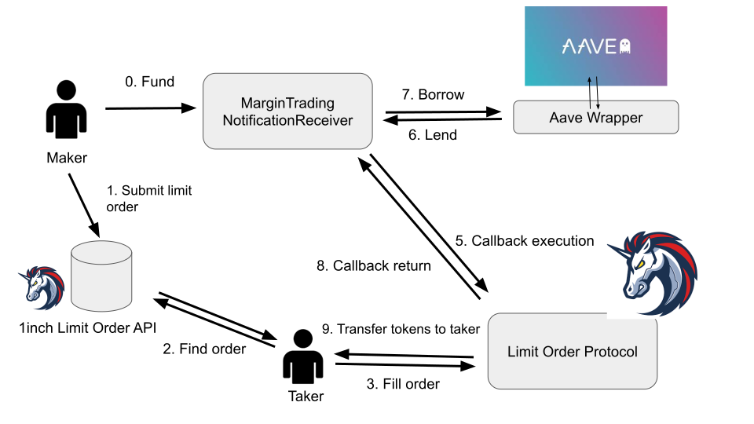

# Margin Limit Order
Margin trading on the 1inch Limit Order Protocol:PoC

1inch Limit Order Protocol is a set of smart contracts. When a limit order is executed, A contract receives a callback and builds a leveraged position by depositing the bought tokens as collateral in the lending protocol (such as Aave) and borrowing the sold tokens. All of this is done by the taker in a single transaction.

## Concept

### 1inch Limit Order Protocol
Key features of the protocol is extreme flexibility and high gas efficiency that achieved by using two different order types - regular Limit Order and RFQ Order.

#### Limit Order
1inch Limit Order Protocol provides extremely flexible limit order, can be configured with:

 1. Order execution predicate.
 2. Helper function for asset price evaluation.
 3. Callback, for to notify maker on order execution.

Maker submits limit order with callback function information added. via 1inch API. When you reach the price you specified, the taker should execute your limit order. When the order is executed, your purchased token will be transferred to the specified contract `MarginTradingNotifReceirver`, and the callback    function will be called.   
The Contract then deposits the token and additional collateral with aave, and use this collateral to borrow tokens to sell to the taker.The borrowed tokens are transferred to the taker, resulting in the creation of a leveraged position.

## Getting Started 
### Installing
To install dependencies, run

`yarn`

### Complipe
`yarn compile`

### Deployment
To depoly on the hardhat network, run

`yarn deploy`

### Test
`yarn test`

If it doesn't work, run  
`yarn hardhat test FILE --deploy-fixture`

## Link
[1inch dApp](https://app.1inch.io/#/1/classic/limit-order/WETH/DAI)

[1inch Limit Order Protocol Doc](https://docs.1inch.io/limit-order-protocol/)

[1inch Limit Order Protocol Utils Doc](https://docs.1inch.io/limit-order-protocol-utils/)

[GitHub: Limit Ordr Protocol](https://github.com/1inch/limit-order-protocol/)

[GitHub: Limit Ordr Protocol Utils](https://github.com/1inch/limit-order-protocol-utils/)

[Aave Flash Credit Delegation](https://docs.aave.com/developers/the-core-protocol/lendingpool#borrow)